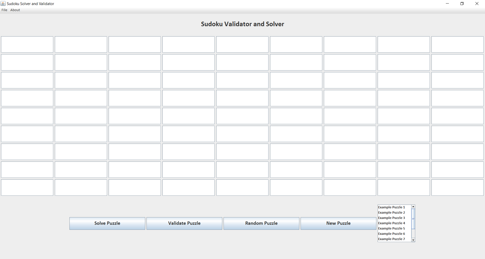
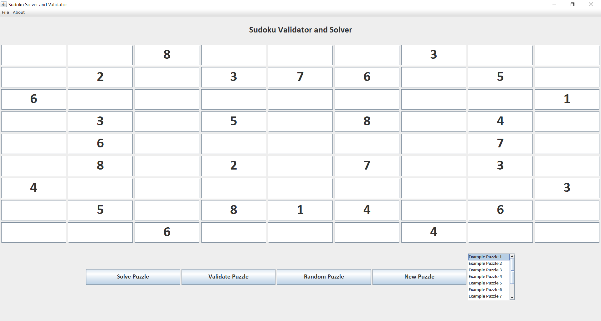
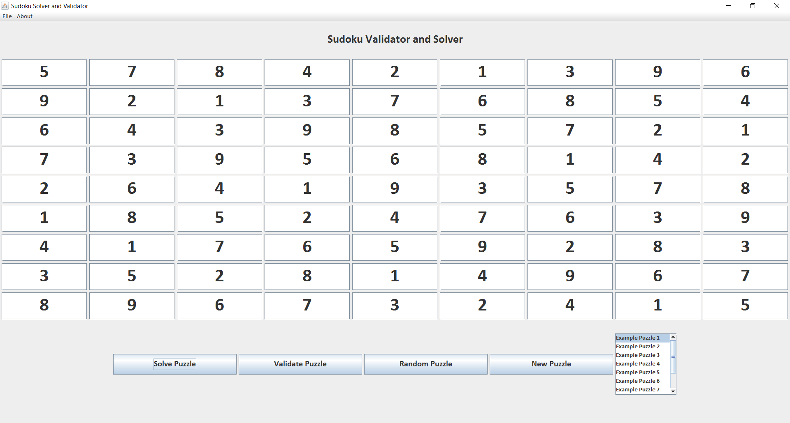

#Sudoku Solver and Validator  
  
###Introduction  
Welcome to Sudoku Solver and Validator, which is an application written in Java targeted to help users solve and validate Sudoku puzzles. Current features include a puzzle solver, which solves the current Sudoku puzzle given to it, a puzzle validator, which validates a given
solution to a Sudoku puzzle, and a random puzzle generator with 10 example puzzles, which allows users to generate and solve a puzzle.  

###Instructions  
To run the application, use any Java IDE (examples include Eclipse, IntelliJ) and run the Main.java class inside the IDE.  

###Screenshots  
Below are screenshots of the application:  

####Main Layout  
  
This shows the main layout of the application. Input a valid Sudoku puzzle and press the "Solve Puzzle" button to generate the solution to 
the puzzle. Input a solution to a Sudoku puzzle and press the "Validate Puzzle" button to determine if the solution is a valid solution. Generate 
a random puzzle out of the 10 example puzzles by pressing the "Random Puzzle" button. Clear the current contents of the puzzle by pressing the 
"New Puzzle" button. You may also select any of the 10 example puzzles by using the list provided to the right of the buttons.  

####Example Puzzle 1  
  
A screenshot of example puzzle 1.  

####Example Puzzle 1 Solved   
  
A screenshot of example puzzle 1 after it has been solved.  

###Additional Features in the Future  
Implement support for multiple sizes of Sudoku puzzles.  
	
